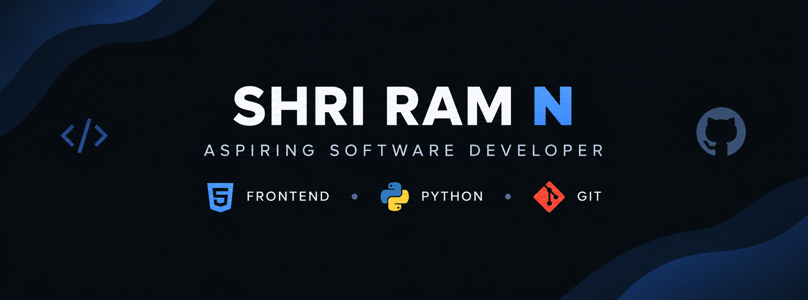

# 👋 Hi, I'm Shri Ram

### Aspiring Software Developer | Frontend & Python

I'm an aspiring software developer focused on building practical applications
and strengthening my programming and problem-solving skills through hands-on development.

---

## About Me

- Interested in Frontend Development and Web Technologies
- Learning and building with Python
- Developing responsive and user-focused web interfaces
- Using Git and GitHub for version control
- Continuously improving my programming and problem-solving skills
- Learning through projects, experimentation, and consistent practice

---

## Technical Skills

**Languages & Web**  
HTML • CSS • JavaScript • Python

**Tools**  
Git • GitHub

---

## Currently Learning

JavaScript • Python • Software Development Practices

---

## Career Goal

To grow into a well-rounded software developer by continuously learning,
building meaningful projects, and solving real-world problems.

---

*Always learning. Always building. Always improving.*
